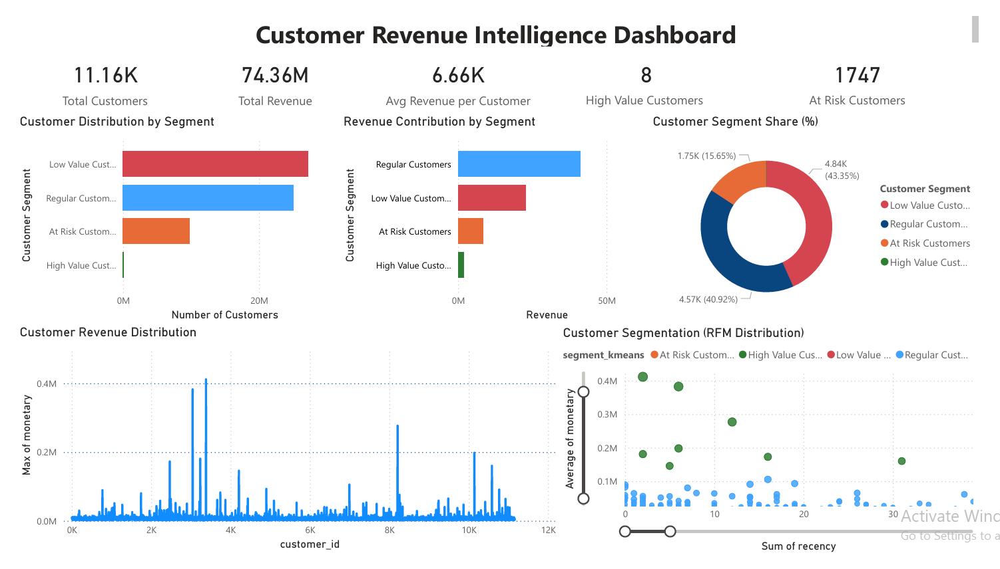

# Customer Revenue Intelligence System

An end-to-end data analytics and machine learning system designed to identify high-value customers, uncover revenue concentration, and proactively detect churn risk using behavioral segmentation and predictive modeling.

Built using ~100,000 transactions across ~11,000 customers to simulate real-world customer behavior and revenue patterns.
---

## Problem Statement

Businesses often lack visibility into:
- Which customers drive the majority of revenue
- How customer value is distributed across segments
- Which customers are at risk of churn before it happens

This results in:
- Inefficient marketing spend
- Missed retention opportunities
- Revenue loss from high-value customers

---

## Solution

Developed a data-driven customer intelligence system that:
- Segments customers using RFM behavioral features  
- Identifies high-value and at-risk customers  
- Quantifies revenue concentration across segments  
- Predicts churn risk using machine learning  
- Visualizes insights through a Power BI dashboard  

---

## Dataset

- ~100,000 transactions  
- ~11,000 unique customers  
- Transaction-level data including customer activity and spending  

---

## Key Results

- Processed ~100,000 transactions across ~11,000 customers to build a customer intelligence system  
- Identified that a very small percentage of customers contributes a disproportionately large share of revenue  
- Discovered ~43% of total revenue is associated with at-risk customer segments  
- Established Recency as the strongest predictor of churn using feature importance analysis  

---

## Analysis & Insights

- Customer value is highly concentrated in a small segment of users  
- A large portion of customers fall into low-value segments with minimal revenue contribution  
- High-value customers exhibit strong monetary contribution but require retention focus  
- At-risk customers represent a significant revenue recovery opportunity  
- Behavioral patterns (recency, frequency) strongly influence churn likelihood  

---

## Business Impact

- Enables targeted retention strategies for high-value customers  
- Helps proactively reduce revenue loss from at-risk customers  
- Supports segmentation-driven marketing and personalization  
- Improves decision-making with data-backed insights  

---

## Methodology

- Performed Exploratory Data Analysis (EDA) to understand customer behavior  
- Engineered RFM (Recency, Frequency, Monetary) features  
- Applied K-Means clustering for segmentation  
- Used Elbow Method and Silhouette Score (~0.39) for cluster validation  
- Built a Random Forest model for churn prediction  
- Analyzed feature importance to identify key drivers  
- Developed a Power BI dashboard for visualization  

---

## Key Components

### RFM Segmentation
- Quantified customer value using Recency, Frequency, and Monetary metrics  
- Enabled clear separation of high-value vs low-value customers  

### Customer Segmentation (K-Means)
- Grouped customers into behavioral clusters  
- Identified high-value, regular, low-value, and at-risk segments  

### Churn Prediction (Random Forest)
- Predicted churn likelihood using behavioral features  
- Identified Recency as the strongest predictor  

### Business Intelligence Dashboard (Power BI)
- Customer distribution by segment  
- Revenue contribution analysis  
- Customer segment share  
- RFM-based behavioral visualization  

---

## Dashboard Preview

[Download Full Dashboard (PDF)](dashboard.pdf)

---

## Tech Stack

- Python (Pandas, NumPy, Scikit-learn)  
- SQL  
- Power BI  
- Machine Learning (Clustering + Classification)  

---

## Project Structure

customer-revenue-intelligence/

- notebooks/
  - data_preprocessing.py  
  - generate_transactions.py  
  - rfm_analysis.py  
  - kmeans_elbow.py  
  - kmeans_segmentation.py  
  - sql_analysis.py  

- dashboard.pbix  
- dashboard.pdf  
- dashboard.png  
- README.md  

---

## Summary

This project demonstrates how data analytics and machine learning can transform raw transactional data into actionable business insights, enabling customer segmentation, churn prediction, and revenue optimization at scale.
